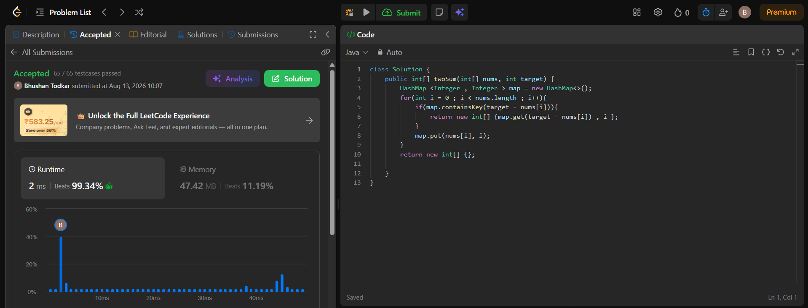

## 1. Two Sum

#### Question :-
1. Two Sum
You are given an array of integers nums and an integer target, return indices of the two numbers such that they add up to target.

You may assume that each input would have exactly one solution, and you may not use the same element twice.

You can return the answer in any order.

 

Example 1:

Input: nums = [2,7,11,15], target = 9
Output: [0,1]
Explanation: Because nums[0] + nums[1] == 9, we return [0, 1].
Example 2:

Input: nums = [3,2,4], target = 6
Output: [1,2]
Example 3:

Input: nums = [3,3], target = 6
Output: [0,1]
 
Constraints:

2 <= nums.length <= 104
-109 <= nums[i] <= 109
-109 <= target <= 109
Only one valid answer exists.

**Difficulty:** Easy  
**Approach:** HashMap (Single Pass)

### Problem
Given an array of integers `nums` and an integer `target`, return indices of the two numbers such that they add up to `target`.

### Approach
Iterate through the array once. For each element, check if its complement (`target - nums[i]`) is already present in a HashMap. If it is, return the stored index and the current index. Otherwise, store the current number and its index in the map for future lookups.

### Complexity
| Metric | Complexity |
|--------|------------|
| Time   | O(n)       |
| Space  | O(n)       |

### Performance
- **Runtime:** 2 ms (Beats 99.34%)
- **Memory:** 47.42 MB (Beats 11.19%)
- **Test Cases:** 65/65 passed ✅

### Result Image
<p align="center">
  
</p>

### Code
```java
class Solution {
    public int[] twoSum(int[] nums, int target) {
        HashMap<Integer, Integer> map = new HashMap<>();
        for (int i = 0; i < nums.length; i++) {
            if (map.containsKey(target - nums[i])) {
                return new int[] {map.get(target - nums[i]), i};
            }
            map.put(nums[i], i);
        }
        return new int[] {};
    }
}
```
