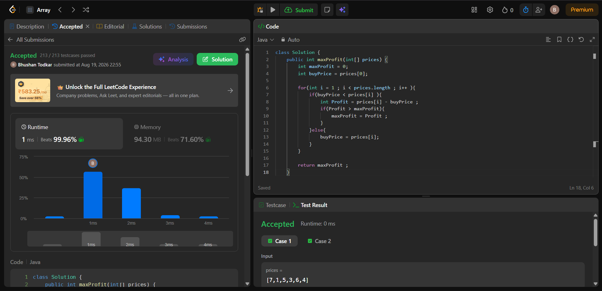

# 121. Best Time to Buy and Sell Stock

## 📋 Problem Statement

You're given an array `prices` where `prices[i]` is the price of a stock on day `i`.

You want to choose a **single day to buy** the stock and a **different day in the future to sell** it, in order to maximize your profit.

Return the maximum profit you can achieve. If no profit is possible, return `0`.

**Example:**
```
Input: prices = [7,1,5,3,6,4]
Output: 5
Explanation: Buy on day 2 (price = 1) and sell on day 5 (price = 6), profit = 6 - 1 = 5.
```

---

## 🧠 Simple Explanation (with Analogy)

Imagine you're watching stock prices over several days, and you can only look **forward in time** — you can't go back and buy at yesterday's price once today has passed.

Think of it like walking down a hallway of price tags, one day at a time, holding a marker pen. You remember the **cheapest tag you've seen so far**. Every time you see a new tag, you ask two questions:

1. "If I had bought at the cheapest price I've seen, and sold today, how much would I make?"
2. "Is today's price actually *cheaper* than the cheapest I've seen? If so, forget the old cheapest — today is my new cheapest."

You never need to remember *every* past price — just the **lowest one so far** and the **best profit found so far**. That's the entire trick.

---

## ⚙️ Approach

1. Start by assuming you bought the stock on **Day 0** (`buyPrice = prices[0]`).
2. Walk through the array starting from Day 1.
3. At each day:
   - If the current price is **higher** than `buyPrice`, calculate the profit you'd make by selling today. If it's better than the best profit seen so far, update `maxProfit`.
   - If the current price is **lower or equal** to `buyPrice`, it means you found a better (cheaper) day to buy — so update `buyPrice` to this new lower price.
4. After the loop finishes, `maxProfit` holds the answer.

This is a **greedy, single-pass** approach — we make the locally best decision at each step without needing to revisit earlier days.

---

## 🔍 Dry Run

Let's trace through `prices = [7, 1, 5, 3, 6, 4]`:

| Day (i) | Price | buyPrice (before)  | Is price > buyPrice?  | Profit | maxProfit (after)   | buyPrice (after)    |
|---------|-------|--------------------|-----------------------|--------|---------------------|---------------------|
| 0       | 7     | 7 (init)           | —                     | —      | 0                   | 7                   |
| 1       | 1     | 7                  | No (1 < 7)            | —      | 0                   | **1** (new low)     |
| 2       | 5     | 1                  | Yes (5 > 1)           | 4      | **4**               | 1                   |
| 3       | 3     | 1                  | Yes (3 > 1)           | 2      | 4 (2 < 4, no update)| 1                   |
| 4       | 6     | 1                  | Yes (6 > 1)           | 5      | **5**               | 1                   |
| 5       | 4     | 1                  | Yes (4 > 1)           | 3      | 5 (3 < 5, no update)| 1                   |

**Final Answer: `maxProfit = 5`** ✅ (Buy at 1 on Day 1, Sell at 6 on Day 4)

---

## ☕ Beginner-Friendly Walkthrough

Think of `buyPrice` as **"the cheapest coffee I've found on my walk so far"** and `maxProfit` as **"the best deal I could have flipped for a profit."**

- Day 0: Coffee costs ₹7. That's the cheapest so far (only option).
- Day 1: Coffee costs ₹1 — cheaper! Update your "cheapest so far" to ₹1.
- Day 2: Coffee costs ₹5. If you'd bought at ₹1 and sold now at ₹5, you'd profit ₹4. Best profit so far: ₹4.
- Day 3: Coffee costs ₹3. Selling now only gives ₹2 profit — worse than ₹4, so ignore.
- Day 4: Coffee costs ₹6. Selling now gives ₹5 profit — better! Update best profit to ₹5.
- Day 5: Coffee costs ₹4. Selling now gives ₹3 profit — worse than ₹5, ignore.

End of walk: your best possible profit was **₹5**.

---

## 💻 Java Solution

```java
class Solution {
    public int maxProfit(int[] prices) {
        int maxProfit = 0;
        int buyPrice = prices[0];

        for (int i = 1; i < prices.length; i++) {
            if (buyPrice < prices[i]) {
                int profit = prices[i] - buyPrice;
                if (profit > maxProfit) {
                    maxProfit = profit;
                }
            } else {
                buyPrice = prices[i];
            }
        }
        return maxProfit;
    }
}
```

---

## 📊 Complexity Analysis

| Metric | Complexity | Explanation |
|--------|------------|--------------|
| **Time**  | `O(n)` | We pass through the `prices` array exactly once. |
| **Space** | `O(1)` | We only use two extra variables (`maxProfit`, `buyPrice`) — no extra data structures. |

---

## ⚠️ Suboptimal Approach (Worth Knowing)

A **brute-force approach** would check every possible pair of buy/sell days using two nested loops:

```java
for (int i = 0; i < prices.length; i++) {
    for (int j = i + 1; j < prices.length; j++) {
        maxProfit = Math.max(maxProfit, prices[j] - prices[i]);
    }
}
```

- **Time Complexity:** `O(n²)` — much slower on large inputs.
- **Space Complexity:** `O(1)`

This works but becomes very slow as the array grows (e.g., 10,000+ days). The single-pass greedy approach above is the optimal solution at `O(n)` time, since we only need one piece of information (the minimum price so far) to make the right decision at every step.

---

## ✅ Performance (My Submission)

| Metric   | Result                          |
|----------|----------------------------------|
| Runtime  | 1 ms (beats 99.94% of Java submissions) |
| Memory   | 93.97 MB (beats 95.33% of Java submissions) |
| Test Cases | 212 / 212 passed ✅ |

> 📸 <p align = "center">
    
</p>

---

## 🏷️ Topics
`Array` `Dynamic Programming` `Greedy`

## 🔗 Difficulty
**Easy**