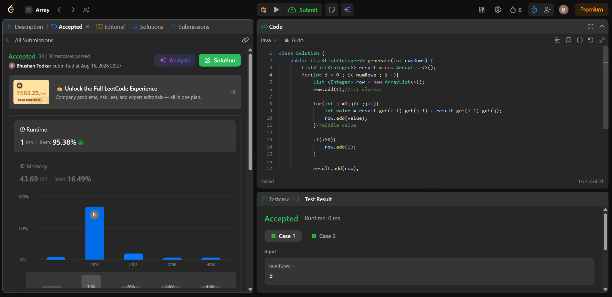

# 118. Pascal's Triangle
 
## Problem Statement
Given an integer numRows, return the first numRows of Pascal's triangle.
In Pascal's triangle, each number is the sum of the two numbers directly above it as shown:

Example 1:
Input: numRows = 5
Output: [[1],[1,1],[1,2,1],[1,3,3,1],[1,4,6,4,1]]

Example 2:
Input: numRows = 1
Output: [[1]]
 
**Example:**
```
Input: numRows = 5
Output: [
     [1],
    [1,1],
   [1,2,1],
  [1,3,3,1],
 [1,4,6,4,1]
]
```
 
---
 
## Intuition (Explained Simply)
 
Think of Pascal's Triangle like stacking rows of bricks, where every row depends only on the row that came right before it.
 
Two simple rules make the whole triangle:
1. **The first and last number of every row is always `1`.**
2. **Every number in between is the sum of the two numbers directly above it** (from the previous row).
So instead of using any complicated math or formula (like factorials/combinations), we can simply **build the triangle row by row**, using the row we just built to construct the next one. This is a very beginner-friendly way to think about 2D array construction.
 
---
 
## Approach — Step by Step
 
1. Create an empty list `result` that will hold all the rows.
2. Loop through `i = 0` to `numRows - 1` (one iteration per row).
3. For each row:
   - Start a new empty list `row`.
   - Add `1` as the **first element** of the row (every row starts with 1).
   - For every middle position `j` (from `1` to `i-1`), calculate:
```
     value = result[i-1][j-1] + result[i-1][j]
```
     This means: *"take the value above-left and above-right from the previous row, and add them."*
   - If this isn't the very first row (`i > 0`), add a final `1` to close the row.
   - Add this completed `row` to `result`.
4. Return `result` once all rows are built.
---
 
## 🔍 Dry Run Example (numRows = 5)
 
Let's trace through the code step by step so it's crystal clear.
 
**i = 0** → First row
- `row.add(1)` → row = `[1]`
- No middle loop runs (since `j < i` means `j < 0`, so nothing happens)
- `i > 0` is false, so we don't add a trailing 1
- `result = [[1]]`
**i = 1** → Second row
- `row.add(1)` → row = `[1]`
- Middle loop: `j` from `1` to `< 1` → doesn't run
- `i > 0` is true → add trailing `1` → row = `[1, 1]`
- `result = [[1], [1,1]]`
**i = 2** → Third row
- `row.add(1)` → row = `[1]`
- Middle loop: `j = 1`
  - `value = result[1][0] + result[1][1] = 1 + 1 = 2`
  - row = `[1, 2]`
- Add trailing `1` → row = `[1, 2, 1]`
- `result = [[1], [1,1], [1,2,1]]`
**i = 3** → Fourth row
- `row.add(1)` → row = `[1]`
- Middle loop: `j = 1, 2`
  - `j=1`: `value = result[2][0] + result[2][1] = 1 + 2 = 3` → row = `[1, 3]`
  - `j=2`: `value = result[2][1] + result[2][2] = 2 + 1 = 3` → row = `[1, 3, 3]`
- Add trailing `1` → row = `[1, 3, 3, 1]`
- `result = [[1], [1,1], [1,2,1], [1,3,3,1]]`
**i = 4** → Fifth row
- `row.add(1)` → row = `[1]`
- Middle loop: `j = 1, 2, 3`
  - `j=1`: `1 + 3 = 4` → row = `[1, 4]`
  - `j=2`: `3 + 3 = 6` → row = `[1, 4, 6]`
  - `j=3`: `3 + 1 = 4` → row = `[1, 4, 6, 4]`
- Add trailing `1` → row = `[1, 4, 6, 4, 1]`
- `result = [[1], [1,1], [1,2,1], [1,3,3,1], [1,4,6,4,1]]`
✅ **Final Output:**
```
[[1], [1,1], [1,2,1], [1,3,3,1], [1,4,6,4,1]]
```
 
This matches Pascal's Triangle exactly — and you can see how each row is built purely from the row above it.
 
---
 
## Complexity Analysis
 
| Complexity | Value | Why |
|---|---|---|
| Time | O(numRows²) | We fill a total of `1 + 2 + 3 + ... + numRows` elements, which is roughly numRows²/2 |
| Space | O(numRows²) | The output itself stores that same triangular number of elements |
 
---
 
## Java Code
 
```java
class Solution {
    public List<List<Integer>> generate(int numRows) {
        List<List<Integer>> result = new ArrayList<>();
        for (int i = 0; i < numRows; i++) {
            List<Integer> row = new ArrayList<>();
            row.add(1); // 1st element
 
            for (int j = 1; j < i; j++) {
                int value = result.get(i-1).get(j-1) + result.get(i-1).get(j);
                row.add(value);
            } // middle value
 
            if (i > 0) {
                row.add(1);
            }
 
            result.add(row);
        }
        return result;
    }
}
```
 
---
 
## Performance Summary
 
| Metric | Result |
|---|---|
| Runtime | 1 ms (beats 95.38%) |
| Memory | 43.69 MB (beats 16.49%) |
| Test Cases | 30 / 30 passed |
 
**Accepted Screenshot:** 
 <p align = "center">
    
</p>

 
---
 
## Key Takeaway
This problem is a great example of **building on previous results** instead of recomputing from scratch — a pattern that shows up often in dynamic programming. Once you understand that each row only needs the row directly above it, the solution becomes intuitive rather than something to memorize.
