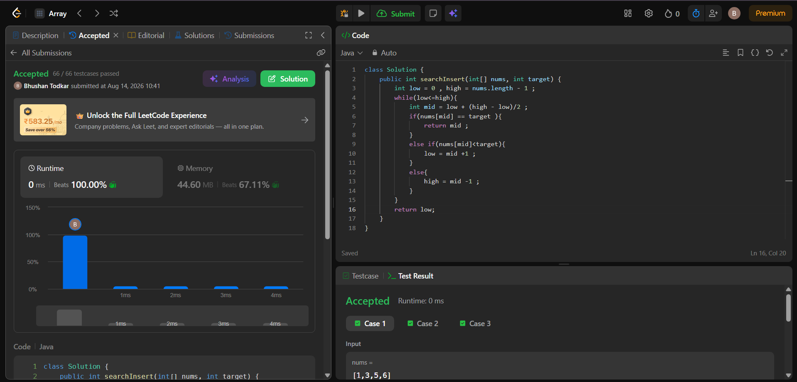

## 35. Search Insert Position

#### Question :- 
35. Search Insert Position
Given a sorted array of distinct integers and a target value, return the index if the target is found. If not, return the index where it would be if it were inserted in order.

You must write an algorithm with O(log n) runtime complexity.

Example 1:

Input: nums = [1,3,5,6], target = 5
Output: 2
Example 2:

Input: nums = [1,3,5,6], target = 2
Output: 1
Example 3:

Input: nums = [1,3,5,6], target = 7
Output: 4
 
Constraints:
1 <= nums.length <= 104
-104 <= nums[i] <= 104
nums contains distinct values sorted in ascending order.
-104 <= target <= 104

**Difficulty:** Easy
**Topics:** Array, Binary Search

### Problem
Given a sorted array of distinct integers and a target value, return the index if the target is found.
If not, return the index where it would be if inserted in order.

### Approach: Binary Search
- Maintain `low` and `high` pointers spanning the array.
- Compute `mid` and compare `nums[mid]` with `target`.
- Narrow the search space by half each iteration based on the comparison.
- When the loop ends (target not found), `low` is exactly the correct insertion index.

### Complexity
| Metric | Complexity |
|--------|-----------|
| Time   | O(log n)  |
| Space  | O(1)      |

### Performance
- Runtime: 0 ms (Beats 100.00%)
- Memory: 44.60 MB (Beats 67.11%)
- Test cases: 66/66 passed ✅

### Result Image 

    

### Code
\`\`\`java
class Solution {
    public int searchInsert(int[] nums, int target) {
        int low = 0, high = nums.length - 1;
        while (low <= high) {
            int mid = low + (high - low) / 2;
            if (nums[mid] == target) {
                return mid;
            } else if (nums[mid] < target) {
                low = mid + 1;
            } else {
                high = mid - 1;
            }
        }
        return low;
    }
}
\`\`\`